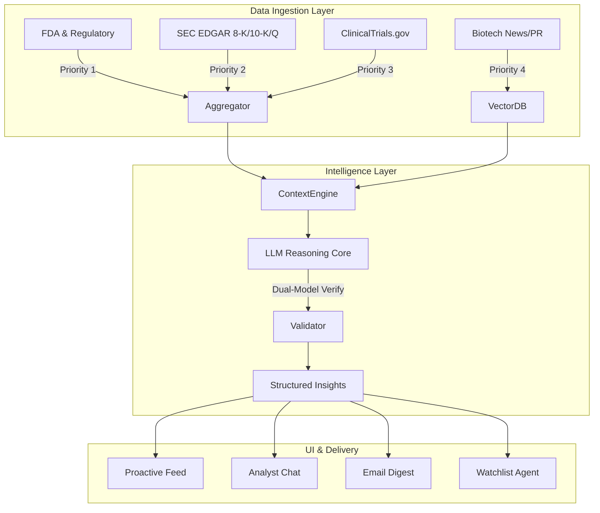

# AI-Native Biopharma Sourcing Platform - Master Specification

> **Vision**: A fully autonomous intelligence platform that "sources" high-probability biotech opportunities by reading, reasoning, and synthesizing the entire biopharma datasphere (Clinical Trials, Regulatory, Financial, and Scientific).

> **Core Value Proposition**: Save users hours of manual research across SEC, FDA, and ClinicalTrials.gov. Deliver AI-synthesized opportunities so they make better biotech investments.

---

## 1. Executive Summary

The goal is to move beyond passive dashboards. This tool will act as an **AI Buy-Side Analyst** that proactively scans the market 24/7. It ingests unstructured noise (10-Ks, FDA calendars, abstract titles) and emits structured, actionable signal ("High Conviction: Phase 3 readout in 25 days with 18 months cash runway").

**Target**: 35 subscribers @ $29/month = $1,000 MRR

---

## 2. Data Architecture

### 2.1 Data Source Priority (Ranked)

| Priority | Source | Signal Type | Update Frequency |
|----------|--------|-------------|------------------|
| 1 | FDA/Regulatory | Catalyst trigger dates | Daily |
| 2 | SEC EDGAR (10-K, 10-Q, 8-K) | Financial health + material events | Daily |
| 3 | ClinicalTrials.gov | Trial details, enrollment, design | Daily |
| 4 | News/PR | Recency supplement | Real-time (future) |

### 2.2 SEC Filing Scope

**10-K / 10-Q** - Extract:
- Cash runway (months remaining)
- Monthly burn rate
- Debt covenants / financing risks

**8-K - Include:**
- Item 1.01 (Material Agreements) → partnerships, licensing deals
- Item 7.01 (Reg FD) → pipeline updates, timeline changes
- Item 8.01 (Other Events) → clinical readouts, FDA meetings

**8-K - Exclude:**
- Insider transactions (Form 4 territory)
- Routine administrative filings

### 2.3 Company Universe

**Filter Logic**: Catalyst Materiality, not just market cap

```
Signal Strength = Catalyst Value / Enterprise Value
```

Prioritize companies where the upcoming readout represents a significant percentage of total value. A $5B drug opportunity for a $5B biotech is binary; for Eli Lilly it's a rounding error.

**Coverage**: All public pharma/biotech companies (no therapeutic area filters)

---

## 3. Intelligence Layer

### 3.1 LLM Role: Analyst (Not Assistant)

The LLM acts as a **trusted analyst** that extracts, synthesizes, and recommends. Users should not need to verify every claim manually.

### 3.2 Trust Infrastructure

| Component | Implementation |
|-----------|----------------|
| **Lightweight Citations** | Every claim includes source reference: `AMGN_2025_10K, pg 42` |
| **Dual-Model Verification** | Primary (Claude) extracts, Secondary (GPT/Gemini) validates. Flag disagreements. |
| **Automated Backtesting** | Sample 10% of extractions, re-verify against source, track accuracy rate. Alert if <95%. |

### 3.3 Model Routing (Cost Optimization)

| Task | Model | Rationale |
|------|-------|-----------|
| Document extraction (10-K parsing) | Haiku 4.5 / Gemini Flash | High volume, structured output |
| Embeddings | text-embedding-3-small | Cheapest option |
| Proactive feed generation | Haiku 4.5 / Gemini Flash | Daily batch |
| Chat - simple lookups | Haiku 4.5 / Gemini Flash | Low complexity |
| Chat - complex reasoning | Sonnet / Gemini Pro | Comparisons, deep dives |
| DCF / deep analysis | Opus / Gemini Pro | Paid tier only |
| Dual-model verification | Haiku vs Flash | Cheap cross-check |

**Target**: ~60-70% cost reduction vs. premium models for everything.

### 3.4 Drug DCF Models

**Tier: Free - Back-of-Envelope DCF**
- Pull peak sales estimates from analyst reports (found in 10-Ks)
- Apply standard phase success probabilities (P2: ~30%, P3: ~60%)
- Discount to present value
- Output: "Est. peak sales: $2B (analyst consensus)"

**Tier: Paid - First-Principles DCF**
- Patient population from epidemiology data (GBD, CDC, LLM extraction)
- Model patient funnel: diagnosed → treated → eligible → market share
- Competitive positioning analysis
- Sensitivity analysis on key assumptions
- Output: Full model with assumptions exposed

### 3.5 Epidemiology Data (Scrappy Approach)

| Source | Cost | Coverage |
|--------|------|----------|
| GBD (Global Burden of Disease) | Free | Comprehensive, academic format |
| CDC WONDER | Free | US-focused, major indications |
| WHO GHO | Free | Global, patchy on rare diseases |
| PubMed LLM extraction | Free (compute) | Gap-filling for specific indications |
| ClinicalTrials.gov enrollment | Free | Sanity check / proxy |

**No commercial licensing for MVP.** All therapeutic areas covered via automated extraction.

---

## 4. User Interface (AI-Native Patterns)

### 4.1 Interaction Paradigms

| Pattern | Purpose | Priority |
|---------|---------|----------|
| **Proactive Feed** | "AI Picks Today" on dashboard load | Primary |
| **Chat with Memory** | Deep dives, "why?" questions, comparisons | Secondary |
| **NL Filters** | "Show me obesity plays under $3B" filters table | Hybrid |
| **Watchlist Agent** | "Track ACAD" → background monitoring + alerts | Background |

### 4.2 Chat Memory Architecture

| Scope | What's Stored | Persistence |
|-------|---------------|-------------|
| **Per-Session** | Conversation context, follow-up queries | Cleared on session end |
| **Per-User** | Watchlist, preferences, past questions | Persistent across sessions |

Examples:
- Session: "What about their cash runway?" (refers to previous ticker in conversation)
- User: "Show my watchlist" (recalls user's saved tickers)

### 4.3 Default Experience

1. **First**: AI-curated view ("Here are today's top opportunities")
2. **Then**: Personalized watchlist ("Here's what changed on YOUR stocks")
3. **Always visible**: 3 AI-recommended opportunities

### 4.4 Tiered Access

| Feature | Free | Paid |
|---------|------|------|
| Catalyst window | <14, <30 days | <90 days + full timeline |
| Company coverage | Limited preview | Full repository |
| DCF model | Back-of-envelope | First-principles |
| Chat queries | Rate-limited | Higher limits |

---

## 5. Notification System

### 5.1 Implement Now

| Channel | Content | Frequency |
|---------|---------|-----------|
| **In-App** | Badge/cards on dashboard for new opportunities | Real-time on load |
| **Email Digest** | Daily summary of catalysts, watchlist changes | Daily (morning) |

### 5.2 Plan Only (Do Not Implement)

> **Note**: Document architecture for future implementation. Do not build in current cycle.

| Channel | Use Case |
|---------|----------|
| **Real-time Push** | Instant alert on 8-K filing, date change |
| **SMS/Telegram** | High-urgency: clinical hold, red flags |

### 5.3 Alert Triggers (All Tiers)

- Catalyst enters time window (<90, <30, <14 days)
- Trial timeline change (delay or acceleration)
- Red flag events (clinical hold, executive departure, financing risk)

### 5.4 Data Refresh Schedule

- **Frequency**: Daily
- **Timing**: Non-peak hours (overnight US, e.g., 2-4 AM ET)
- **Rationale**: Minimize API rate limit issues, data ready for morning users

---

## 6. System Architecture



---

## 7. Implementation Phases

### Phase 1: Foundation ✅ COMPLETE
- ClinicalTrials.gov API integration
- Basic SEC downloader
- Streamlit dashboard frame

`Output: <promise>PHASE_1_COMPLETE</promise>`

---

### Phase 2: Launch MVP 🚧 CURRENT
**Objective**: First paying customer

| Component | Status | Priority |
|-----------|--------|----------|
| FDA calendar integration | ✅ DONE | Must Have |
| SEC 8-K/10-K extraction | ✅ DONE | Must Have |
| ClinicalTrials.gov pipeline (enhanced) | ✅ DONE | Must Have |
| Proactive daily feed | ✅ DONE | Must Have |
| Email digest | ✅ DONE | Must Have |
| Basic chat | ✅ DONE | Must Have |

#### 7.1 Phase 2 MVP Detailed Specification

##### 7.1.1 Database Schema (Local SQLite → Supabase)

**Development Strategy:**
- Local: SQLite (`data/radar.db`)
- Production: Supabase (Postgres + pgvector)
- Migration: Same SQL schema, swap connection string

**Core Tables:**

```sql
-- Companies (master list)
CREATE TABLE companies (
    id INTEGER PRIMARY KEY,
    ticker TEXT UNIQUE NOT NULL,
    name TEXT NOT NULL,
    market_cap_usd REAL,
    enterprise_value_usd REAL,
    sector TEXT DEFAULT 'Biotech',
    created_at TIMESTAMP DEFAULT CURRENT_TIMESTAMP,
    updated_at TIMESTAMP DEFAULT CURRENT_TIMESTAMP
);

-- Catalysts (the core data)
CREATE TABLE catalysts (
    id INTEGER PRIMARY KEY,
    company_id INTEGER REFERENCES companies(id),
    catalyst_type TEXT NOT NULL,  -- 'PDUFA', 'Phase2_Readout', 'Phase3_Readout', 'AdCom', 'CRL_Response'
    catalyst_date DATE,
    catalyst_date_precision TEXT,  -- 'exact', 'month', 'quarter', 'half', 'year'
    indication TEXT,
    drug_name TEXT,
    trial_phase TEXT,  -- 'Phase1', 'Phase2', 'Phase3', 'NDA', 'BLA'
    trial_nct_id TEXT,
    source TEXT NOT NULL,  -- 'FDA', 'SEC_8K', 'CTgov', 'Manual'
    source_reference TEXT,  -- 'ACAD_2025_10K, pg 42'
    confidence_score REAL,  -- 0-1, from LLM extraction
    created_at TIMESTAMP DEFAULT CURRENT_TIMESTAMP,
    updated_at TIMESTAMP DEFAULT CURRENT_TIMESTAMP
);

-- SEC Filings (raw + extracted)
CREATE TABLE sec_filings (
    id INTEGER PRIMARY KEY,
    company_id INTEGER REFERENCES companies(id),
    filing_type TEXT NOT NULL,  -- '10-K', '10-Q', '8-K'
    filing_date DATE NOT NULL,
    accession_number TEXT UNIQUE,
    file_path TEXT,  -- local path to downloaded filing
    cash_runway_months REAL,  -- extracted
    monthly_burn_rate_usd REAL,  -- extracted
    extracted_at TIMESTAMP,
    raw_text TEXT,  -- for re-processing
    created_at TIMESTAMP DEFAULT CURRENT_TIMESTAMP
);

-- FDA Calendar Events
CREATE TABLE fda_events (
    id INTEGER PRIMARY KEY,
    company_id INTEGER REFERENCES companies(id),
    event_type TEXT NOT NULL,  -- 'PDUFA', 'AdCom', 'CRL', 'Approval', 'RTF'
    event_date DATE,
    drug_name TEXT,
    indication TEXT,
    source_url TEXT,
    created_at TIMESTAMP DEFAULT CURRENT_TIMESTAMP
);

-- Clinical Trials (from CTgov)
CREATE TABLE clinical_trials (
    id INTEGER PRIMARY KEY,
    company_id INTEGER REFERENCES companies(id),
    nct_id TEXT UNIQUE NOT NULL,
    title TEXT,
    phase TEXT,
    status TEXT,  -- 'Recruiting', 'Active', 'Completed', 'Terminated'
    conditions TEXT,  -- JSON array
    interventions TEXT,  -- JSON array
    primary_completion_date DATE,
    study_completion_date DATE,
    enrollment_count INTEGER,
    trial_design_score REAL,  -- LLM-assessed quality (0-100)
    trial_design_notes TEXT,  -- 'Double-blind, placebo-controlled'
    created_at TIMESTAMP DEFAULT CURRENT_TIMESTAMP,
    updated_at TIMESTAMP DEFAULT CURRENT_TIMESTAMP
);

-- AI Insights (proactive feed)
CREATE TABLE insights (
    id INTEGER PRIMARY KEY,
    company_id INTEGER REFERENCES companies(id),
    catalyst_id INTEGER REFERENCES catalysts(id),
    insight_type TEXT NOT NULL,  -- 'opportunity', 'red_flag', 'update'
    headline TEXT NOT NULL,  -- 'ACAD: Phase 3 readout in 14 days'
    body TEXT,  -- Extended explanation
    conviction_score REAL,  -- 0-100
    factors TEXT,  -- JSON: {"days_to_catalyst": 14, "cash_runway": 18, ...}
    source_citations TEXT,  -- JSON array of source references
    generated_at TIMESTAMP DEFAULT CURRENT_TIMESTAMP,
    expires_at TIMESTAMP,  -- After catalyst date
    is_active BOOLEAN DEFAULT TRUE
);

-- Users (for auth + preferences)
CREATE TABLE users (
    id INTEGER PRIMARY KEY,
    email TEXT UNIQUE NOT NULL,
    stripe_customer_id TEXT,
    subscription_status TEXT DEFAULT 'free',  -- 'free', 'active', 'cancelled'
    subscription_tier TEXT DEFAULT 'free',  -- 'free', 'paid'
    watchlist TEXT,  -- JSON array of tickers
    preferences TEXT,  -- JSON: notification settings, etc.
    created_at TIMESTAMP DEFAULT CURRENT_TIMESTAMP,
    last_login_at TIMESTAMP
);

-- Email Digest Log
CREATE TABLE email_digests (
    id INTEGER PRIMARY KEY,
    user_id INTEGER REFERENCES users(id),
    sent_at TIMESTAMP DEFAULT CURRENT_TIMESTAMP,
    insight_ids TEXT,  -- JSON array of insight IDs included
    status TEXT  -- 'sent', 'failed', 'bounced'
);

-- Indexes for performance
CREATE INDEX idx_catalysts_date ON catalysts(catalyst_date);
CREATE INDEX idx_catalysts_company ON catalysts(company_id);
CREATE INDEX idx_insights_active ON insights(is_active, generated_at);
CREATE INDEX idx_companies_ticker ON companies(ticker);
```

##### 7.1.2 Component Specifications

**A. FDA Calendar Integration**

| Spec | Detail |
|------|--------|
| Source | OpenFDA API + FDA Press Releases |
| Data extracted | PDUFA dates, AdCom meetings, approvals, CRLs |
| Output | Rows in `fda_events` + linked `catalysts` |
| Update frequency | Daily @ 2 AM ET |
| Acceptance criteria | ≥90% of known PDUFA dates captured |

**B. SEC 8-K/10-K Extraction**

| Spec | Detail |
|------|--------|
| Source | sec-edgar-downloader |
| Filing types | 10-K, 10-Q (financials), 8-K (events) |
| LLM extraction | Cash runway, burn rate, material events |
| Prompt template | See `prompts/sec_extraction.txt` |
| Output | Rows in `sec_filings` with extracted fields |
| Citation format | `{TICKER}_{YEAR}_{FILING_TYPE}, pg {PAGE}` |
| Acceptance criteria | Cash runway within ±2 months of manual check |

**C. ClinicalTrials.gov Pipeline (Enhanced)**

| Spec | Detail |
|------|--------|
| Enhancement vs Phase 1 | Add trial design scoring, better date parsing |
| Trial design score | LLM rates 0-100 based on blinding, control, endpoints |
| Date precision | Parse "Q3 2025" vs "September 2025" vs exact date |
| Output | Rows in `clinical_trials` + linked `catalysts` |
| Acceptance criteria | All Phase 2/3 trials with completion dates captured |

**D. Proactive Daily Feed**

| Spec | Detail |
|------|--------|
| Generation time | Daily @ 5 AM ET (after data refresh) |
| Algorithm | Score = f(days_to_catalyst, cash_runway, trial_quality, materiality) |
| Output | Top 10 insights in `insights` table, top 3 featured |
| UI display | Cards on dashboard, sorted by conviction score |
| Free tier | Show top 3, blur rest |
| Acceptance criteria | User sees opportunities without any filtering |

**E. Email Digest**

| Spec | Detail |
|------|--------|
| Provider | Resend (free tier: 3K emails/month) or SendGrid |
| Send time | Daily @ 7 AM ET (user's timezone in V1.1) |
| Content | Top 3 opportunities + watchlist updates |
| Template | HTML email, mobile-responsive |
| Trigger | Cron job, only sends if new insights exist |
| Acceptance criteria | Email delivered with correct catalyst data |

**F. Basic Chat**

| Spec | Detail |
|------|--------|
| Supported queries | "What's [TICKER]'s next catalyst?", "Show me [INDICATION] trials" |
| Model | Haiku 4.5 (simple) / Sonnet (complex) |
| Context | Query `catalysts`, `insights`, `sec_filings` tables |
| Memory | Per-session only (V1.1 adds per-user) |
| Response time | <5 seconds |
| Acceptance criteria | Answers ticker lookup correctly with source citation |

##### 7.1.3 MVP Launch Checklist

```
MVP is DONE when ALL boxes checked:

Data Pipeline:
- [x] FDA calendar populates `fda_events` table daily
- [x] SEC filings downloaded and parsed for top 100 biotechs
- [x] CTgov trials synced with design scores
- [ ] `catalysts` table has ≥500 upcoming events (104 currently, grows with daily cron)

Proactive Feed:
- [x] Daily feed generates 10+ insights
- [x] Top 3 displayed on dashboard load
- [x] Each insight shows: headline, date, source citation
- [x] Free tier blurs items 4-10

Email:
- [x] Digest sends at 7 AM ET
- [x] Contains top 3 opportunities
- [x] Unsubscribe link works

Chat:
- [x] "What's ACAD's next catalyst?" returns correct answer
- [x] Response includes source citation
- [x] Response time <5 seconds

Auth/Paywall:
- [x] User can sign up with email
- [ ] Stripe checkout works for $29/month
- [x] Paid users see full feed (no blur)

Deployment:
- [ ] Runs on Streamlit Cloud
- [x] GitHub Actions cron runs daily
- [x] No secrets exposed
```

##### 7.1.4 MVP Success Criteria

| Metric | Target | Measurement |
|--------|--------|-------------|
| Data coverage | ≥100 biotechs with catalysts | COUNT(DISTINCT company_id) |
| Feed quality | 3+ actionable opportunities daily | Manual review |
| Extraction accuracy | ≥90% correct | 10% sample backtest |
| Chat response time | <5 seconds | p95 latency |
| Email delivery | ≥95% delivered | Resend dashboard |
| First paying customer | 1 | Stripe dashboard |

`Output: <promise>PHASE_2_COMPLETE</promise>` when all checklist items pass.

---

### Phase 3: V1.1 Enhancements
| Component | Status |
|-----------|--------|
| DCF first-principles model | Planned |
| Dual-model verification | Planned |
| NL filters on dashboard | Planned |
| Watchlist agent | Planned |
| Backtesting pipeline | Planned |
| Chat with memory | Planned |

**Phase 3 Success Criteria:**
- DCF model generates valuation for any catalyst
- NL query "show me obesity under $3B" filters correctly
- Watchlist alerts trigger on material changes
- Backtesting shows ≥95% extraction accuracy

`Output: <promise>PHASE_3_COMPLETE</promise>` when all criteria pass.

---

### Phase 4: V2+ Future
| Component | Status |
|-----------|--------|
| Real-time push notifications | Planned (architecture only) |
| SMS/Telegram alerts | Planned (architecture only) |
| Competitive landscaping | Planned |
| PubMed/conference integration | Planned |
| Management track record | Planned |
| Broker/TradingView embeds | Planned |

**Phase 4 Success Criteria:**
- System autonomously surfaces opportunities without human query
- Competitive landscape shows all players in same indication
- Conference abstracts mapped to public tickers

`Output: <promise>PHASE_4_COMPLETE</promise>` when all criteria pass.

---

## 8. Technology Specifications

### Core Stack
- **Language**: Python 3.10+
- **App Framework**: Streamlit
- **Database**:
  - Development: SQLite (`data/radar.db`)
  - Production: Supabase (Postgres + pgvector)
- **Orchestration**: GitHub Actions (daily cron @ 2 AM ET)

### AI Stack
- **Primary LLM**: Claude Haiku 4.5 (extraction, simple queries)
- **Secondary LLM**: Gemini Flash (verification, batch processing)
- **Premium LLM**: Claude Sonnet/Opus (complex reasoning, paid features)
- **Embeddings**: OpenAI text-embedding-3-small

### Data Stack
- **Structured**: ClinicalTrials.gov API, OpenFDA
- **Unstructured**: sec-edgar-downloader, BeautifulSoup

---

## 9. Success Criteria

1. **Zero-Click Insights**: User opens dashboard → sees "Top 3 Opportunities Today" without filtering
2. **Visual Reasoning**: System explains *why* it likes a setup with source citations
3. **Hallucination Guardrails**: Every AI claim links to source (e.g., `AMGN_2025_10K, pg 42`)
4. **Speed**: Chat answers in <3 seconds using pre-computed embeddings
5. **Trust**: >95% accuracy on backtested extractions

---

## 10. Cost Model

### Per-User Economics

| Usage Pattern | Monthly LLM Cost | Margin @ $29/mo |
|---------------|------------------|-----------------|
| Light (5 chats/day) | ~$3-5 | ~$24 |
| Medium (20 chats/day) | ~$10-15 | ~$14-19 |
| Heavy (50+ queries) | ~$25-40 | Breakeven |

### Cost Controls
- Aggressive caching (same query = cached response)
- Batch proactive feed (one job serves all users)
- Model routing (Haiku/Flash for 80% of tasks)
- Pre-compute insights (generate once, serve statically)

---

## 11. Completion Promise

### Phase Completion Signals

| Phase | Signal | Meaning |
|-------|--------|---------|
| Phase 1 | `<promise>PHASE_1_COMPLETE</promise>` | Foundation built |
| Phase 2 | `<promise>PHASE_2_COMPLETE</promise>` | MVP launched, first paying customer |
| Phase 3 | `<promise>PHASE_3_COMPLETE</promise>` | V1.1 enhancements shipped |
| Phase 4 | `<promise>PHASE_4_COMPLETE</promise>` | Full autonomous sourcing |

### Final Completion

When the system can **autonomously source, filter, and explain** a biotech trade idea without human query intervention:

`Output: <promise>PROJECT_COMPLETE</promise>`

**Criteria for PROJECT_COMPLETE:**
- [ ] All Phase 1-4 signals emitted
- [ ] System runs 30 days without manual intervention
- [ ] ≥35 paying subscribers ($1K MRR target)
- [ ] User NPS ≥ 40

---

## Appendix: Interview Decisions Log

| Date | Topic | Decision |
|------|-------|----------|
| 2025-01-05 | Data Priority | FDA → SEC → CTgov → News |
| 2025-01-05 | 8-K Scope | Deals + pipeline; exclude insider txns |
| 2025-01-05 | Timing Windows | Free: <30d / Paid: <90d + full timeline |
| 2025-01-05 | Universe Filter | Catalyst materiality, not market cap |
| 2025-01-05 | DCF Tiers | Free: back-of-envelope / Paid: first-principles |
| 2025-01-05 | Epi Data | Scrappy: GBD + CDC + LLM ($0 licensing) |
| 2025-01-05 | LLM Role | Analyst (trusted), not assistant |
| 2025-01-05 | Trust Infra | Citations + dual-model + 10% backtesting |
| 2025-01-05 | Alerts Now | In-app + email digest |
| 2025-01-05 | Alerts Later | Push + SMS (plan only, don't build) |
| 2025-01-05 | UI Patterns | Proactive feed + Chat + NL filters + Watchlist |
| 2025-01-05 | Cost Control | Haiku 4.5 / Gemini Flash default |
| 2025-01-05 | Data Refresh | Daily, non-peak hours (overnight US) |
| 2025-01-05 | Chat Memory | Per-session (context) + per-user (watchlist, prefs) |
| 2025-01-05 | Database | Local SQLite for dev → Supabase for prod |
