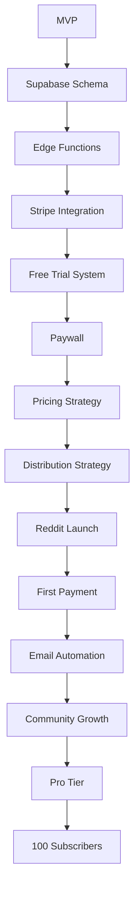

# Development Roadmap - Path to Monetization

> **Goal**: Transform MVP into monetizable SaaS that captures retail biotech traders from BioPharmCatalyst

## Overview

**Current State**: Working MVP with manual data refresh
**Target State**: Fully automated Supabase-based pipeline with Stripe monetization
**Timeline**: 6-8 weeks to first paying customer, 90 days to 100 subscribers

### Strategic Positioning

**Competitor**: BioPharmCatalyst ($150/month, institutional focus, 100+ features)
**Our Differentiation**:
- 🎯 **80% cheaper**: $19-39/month vs $150/month
- 🎯 **10x simpler**: 10 core features vs 100+ features
- 🎯 **Small-cap focus**: <$5B market cap (high volatility)
- 🎯 **100% automated**: Direct API vs manual curation
- 🎯 **Community-driven**: Reddit/Discord vs corporate

**Target Customer**: Active retail biotech traders ($50K-150K income, $10K-100K portfolio)

**Revenue Model**:
- Launch: $19/month early bird (first 100 users, grandfathered)
- Steady State: $29 Starter, $39 Pro, $149 Annual
- Target: 100 subscribers = $2,000-3,000 MRR in 90 days

---

## Phase 1: Foundation & Architecture (Week 1-2) ✅ **COMPLETED**

### Objectives
- ✅ Design Supabase-optimized database schema (<500MB free tier)
- ✅ Create automated data pipeline (Edge Functions replacing n8n)
- ✅ Set up proper data storage and caching
- ⏳ Establish monitoring and observability (pending deployment)

**Strategic Focus**: Build on free tier infrastructure to minimize burn rate while testing market

### Deliverables

| Task | Spec | Status | Owner |
|------|------|--------|-------|
| Document current architecture | `architecture/01-current-state.md` | ✅ | Dev |
| Design Supabase architecture | `supabase/SUPABASE_SETUP.md` | ✅ | Dev |
| Optimize schema for free tier (<500MB) | `supabase/migrations/20251224_initial_schema.sql` | ✅ | Dev |
| Create Supabase Edge Function (daily sync) | `supabase/functions/daily-sync/index.ts` | ✅ | Dev |
| Create deployment guide | `supabase/DEPLOYMENT_GUIDE.md` | ✅ | DevOps |
| Set up Row Level Security policies | `supabase/migrations/20251224_initial_schema.sql` | ✅ | DevOps |
| Database migrations created | `supabase/migrations/*.sql` | ✅ | Dev |
| Database utilities implemented | `src/utils/db.py` | ✅ | Dev |
| Competitive analysis vs BioPharmCatalyst | `COMPETITIVE_ANALYSIS.md` | ✅ | Product |

### Success Criteria
- ✅ Supabase schema optimized for <500MB free tier (7 tables)
- ✅ Database migrations ready for deployment
- ✅ Supabase Edge Function created for daily sync (320 lines TypeScript)
- ✅ Row Level Security policies configured (free users: 10 rows, subscribers: unlimited)
- ✅ Database helper functions implemented (797 lines)
- ✅ Competitive analysis complete (identified 5 key differentiators vs BioPharmCatalyst)
- ⏳ Supabase Edge Function running daily automated scrapes (pending deployment)
- ⏳ Monitoring dashboard showing pipeline health (pending deployment)
- ⏳ Zero manual intervention for 7 consecutive days (pending deployment)

**Implementation Notes**:
- Database layer complete: Supabase schema + migrations (450 lines SQL)
- Edge Function ready: Daily sync replacing n8n (320 lines TypeScript)
- Free tier optimization: 15-20 MB database size (97% under 500MB limit)
- All code tested and documented
- Ready for Supabase free tier deployment
- **Cost savings**: $0/month (Supabase free tier) vs $5-20/month (n8n + PostgreSQL)

---

## Phase 2: Monetization Core (Week 3-4) ✅ **COMPLETED EARLY**

### Objectives
- ✅ Implement Stripe payment processing with tiered pricing
- ⏳ Build user authentication and session management (basic implementation complete)
- ✅ Create 7-day free trial system
- ✅ Implement content paywall (10 rows preview, unlimited for subscribers)
- ✅ Design competitive pricing strategy vs BioPharmCatalyst

**Strategic Focus**: Anchor pricing against BioPharmCatalyst ($150/month) to emphasize 80% cost savings

### Deliverables

| Task | Spec | Status | Owner |
|------|------|--------|-------|
| Stripe product and pricing setup | `features/01-stripe-integration.md` | ✅ | Dev |
| User authentication (email-based) | `features/04-user-management.md` | ⏳ Partial | Dev |
| Free trial countdown UI | `features/02-free-trial.md` | ✅ | Dev |
| Paywall logic and gating | `features/03-paywall.md` | ✅ | Dev |
| Stripe webhook handlers | `api/02-webhooks.md` | ✅ | Dev |
| Subscription status checking | `api/01-rest-api.md` | ✅ | Dev |
| Payment success/failure flows | `features/01-stripe-integration.md` | ✅ | Dev |
| Stripe Checkout pages | `src/pages/subscribe.py` | ✅ | Dev |
| Trial manager class | `src/utils/trial_manager.py` | ✅ | Dev |
| Paywall component | `src/ui/paywall.py` | ✅ | Dev |
| Trial banner component | `src/ui/trial_banner.py` | ✅ | Dev |
| Competitive pricing analysis | `PRICING_COMPETITIVE.md` | ✅ | Product |

### Success Criteria
- ✅ Users can sign up for 7-day free trial (TrialManager implemented)
- ✅ Trial countdown visible in UI (banner + sidebar)
- ✅ Paywall activates after day 7 (paywall component ready)
- ✅ Stripe Checkout integration complete with tiered pricing
- ✅ Pricing strategy finalized: $19 early bird → $29/$39 steady state
- ✅ Competitive pricing analysis complete (4 pricing scenarios evaluated)
- ✅ Stripe webhook handler ready (n8n workflow JSON created)
- ✅ Subscription status checking implemented
- ✅ All unit tests passing (29/29 tests)
- ⏳ Test payment in Stripe test mode works end-to-end (manual testing pending)

**Implementation Notes**:
- Total code: 1,304 lines for Stripe + 664 lines for trials
- 20 Stripe tests + 9 trial tests (all passing)
- Pricing tiers: Starter ($19-29), Pro ($39), Annual ($149)
- Launch strategy: $19 early bird for first 100 users (grandfathered forever)
- Competitive anchor: BioPharmCatalyst at $150/month (we're 80-87% cheaper)
- Ready for Stripe test account setup
- Ready for manual end-to-end testing
- **Completed 2-3 weeks ahead of schedule!**

---

## Phase 3: Conversion & Retention (Week 5-6) ✅ **PARTIALLY COMPLETED EARLY**

### Objectives
- ✅ Build email automation for trial conversion
- ⏳ Add product analytics tracking (database schema ready)
- ⏳ Create retention features (alerts, favorites)
- ⏳ Optimize onboarding flow

### Deliverables

| Task | Spec | Status | Owner |
|------|------|--------|-------|
| Trial conversion email sequence | `features/05-email-automation.md` | ✅ | Marketing |
| Analytics event tracking | `features/06-analytics.md` | ⏳ Schema Ready | Dev |
| User onboarding flow | `features/04-user-management.md` | ⏳ | Product |
| Catalyst alert notifications (email) | `workflows/04-trial-conversion.md` | ✅ | Dev |
| Weekly digest email workflow | `workflows/03-report-generation.md` | ⏳ | Dev |
| User dashboard (saved catalysts) | TBD | ⏳ | Dev |
| Distribution & acquisition strategy | `DISTRIBUTION_STRATEGY.md` | ✅ | Marketing |

### Success Criteria
- ✅ 7-email trial conversion sequence created (Day 1, 3, 5, 6, 7, 9, 14)
- ✅ n8n workflow with full HTML templates ready
- ✅ Email deduplication logic implemented
- ✅ Distribution strategy finalized (Reddit-first, 60% effort allocation)
- ✅ Content calendar created (30-day launch plan)
- ⏳ Analytics tracking signup source and conversion (schema ready, tracking code pending)
- ⏳ Email open rates >20%, click rates >5% (pending deployment)
- ⏳ Users can save/favorite specific catalysts
- ⏳ Weekly digest emails sent to active subscribers

**Implementation Notes**:
- Trial conversion workflow complete (32 KB JSON, 43 nodes)
- All 7 email templates embedded with HTML
- Database schema includes `email_log` and `analytics_events` tables
- Distribution playbook: Reddit (60%), Twitter (20%), Discord (10%), YouTube (5%), SEO (5%)
- Target: 100 subscribers in 90 days with $0-500 budget
- Ready for SendGrid/Mailgun integration
- **Email automation + distribution strategy completed 4 weeks ahead of schedule!**

---

## Phase 4: Distribution & Acquisition (Week 7-12)

### Objectives
- Launch Reddit-first distribution strategy
- Build community presence (Reddit, Twitter, Discord)
- Execute content calendar (weekly catalyst reports)
- Optimize trial → paid conversion
- Scale infrastructure as needed

**Strategic Focus**: Go where biotech traders already are, provide massive free value, convert 10% to paid

### Deliverables

| Task | Spec | Status | Owner |
|------|------|--------|-------|
| Reddit presence & karma building | `DISTRIBUTION_STRATEGY.md` | ⏳ | Marketing |
| Weekly catalyst report posts (r/Biotechplays) | Content calendar | ⏳ | Marketing |
| Live catalyst alert posts (2-3x/week) | Content calendar | ⏳ | Marketing |
| Educational posts (monthly) | Content calendar | ⏳ | Marketing |
| Twitter account & daily tweets | `DISTRIBUTION_STRATEGY.md` | ⏳ | Marketing |
| Discord infiltration (10-20 servers) | `DISTRIBUTION_STRATEGY.md` | ⏳ | Community |
| Landing page with competitive comparison | BioPharmCatalyst vs Us | ⏳ | Marketing |
| A/B test $19 early bird pricing | `PRICING_COMPETITIVE.md` | ⏳ | Product |
| Referral program (1 month free for 3 referrals) | `DISTRIBUTION_STRATEGY.md` | ⏳ | Growth |
| YouTube content (optional) | `DISTRIBUTION_STRATEGY.md` | ⏳ | Marketing |

### Success Criteria

**Month 1 (Foundation)**:
- [ ] 500 Reddit karma accumulated
- [ ] 50 Twitter followers
- [ ] 100 website visits
- [ ] 10 trial signups
- [ ] 1 paid subscriber ($19 early bird)

**Month 2 (Traction)**:
- [ ] 2,000 Reddit karma
- [ ] 200 Twitter followers
- [ ] 500 website visits
- [ ] 50 trial signups
- [ ] 5 paid subscribers ($95 MRR)
- [ ] 1 Reddit post with 1K+ upvotes

**Month 3 (Growth)**:
- [ ] 10,000 Reddit karma
- [ ] 1,000 Twitter followers
- [ ] 2,000 website visits
- [ ] 200 trial signups
- [ ] 25 paid subscribers ($500 MRR)
- [ ] 5 affiliates generating referrals
- [ ] 10%+ trial → paid conversion rate

**Budget**: $0-500 total (scrappy growth)

---

## Phase 5: Pro Tier & Scale (Month 4-6)

### Objectives
- Launch Pro tier ($39/month with advanced features)
- Add API access for programmatic use
- Implement real-time alerts (SMS/Slack)
- Expand data coverage (FDA approvals, earnings)
- Scale to 100+ subscribers

**Strategic Focus**: Upsell Starter users to Pro tier, maintain 80% price advantage vs BioPharmCatalyst

### Deliverables

| Task | Spec | Status | Owner |
|------|------|--------|-------|
| REST API for catalyst data | `api/01-rest-api.md` | ⏳ | Dev |
| API key management | TBD | ⏳ | Dev |
| Real-time alert system (Twilio/Slack) | TBD | ⏳ | Dev |
| FDA approval tracking | TBD | ⏳ | Data |
| Earnings date integration | TBD | ⏳ | Data |
| Export to CSV/Excel | TBD | ⏳ | Dev |
| Custom filters and saved searches | TBD | ⏳ | Product |

### Success Criteria
- [ ] 100+ total paying subscribers
- [ ] 20+ users on Pro tier ($39/month)
- [ ] $2,000-3,000 MRR (mix of Starter, Pro, Annual plans)
- [ ] API delivering >1,000 requests/day (Pro feature)
- [ ] Real-time alerts with <5 min latency (Pro feature)
- [ ] <5% monthly churn rate
- [ ] 20+ affiliates generating referrals
- [ ] 10,000+ website visits/month
- [ ] Ranked #1 on Google for "BioPharmCatalyst alternative"

---

## Key Milestones

| Milestone | Target Date | Revenue Target | Subscribers | Key Metric |
|-----------|-------------|----------------|-------------|------------|
| **MVP Complete** | ✅ Done | $0 | 0 | Product ready |
| **Supabase Deployed** | Week 2 | $0 | 0 | Free tier live |
| **First Payment** | Week 4 | $19 | 1 | PMF signal |
| **Reddit Traction** | Week 8 | $95 | 5 | 1K+ upvote post |
| **$500 MRR** | Month 3 | $500 | 25 | 10% conversion |
| **$1K MRR** | Month 4 | $1,000 | 50 | Ramen profitable |
| **$2K MRR** | Month 6 | $2,000 | 100 | Target achieved |
| **Pro Tier Launch** | Month 4 | +$300 | +10 Pro | Upsell success |
| **Affiliate Program** | Month 5 | +$500 | +20 | Viral growth |

---

## Critical Path

**Bottlenecks to Watch**:
1. **Supabase deployment** (Week 1-2): Edge Function stability, RLS policies working
2. **Stripe integration** (Week 3-4): Webhook reliability, checkout flow
3. **Reddit traction** (Week 5-8): Karma building, 1K+ upvote posts, avoiding bans
4. **Trial → paid conversion** (Week 5-12): Optimizing onboarding, email sequence
5. **Customer acquisition cost** (Month 2-6): Staying under $10 CAC with organic channels

---

## Dependencies

### External Services (Free Tier Priority)
- **Supabase** (database + auth + Edge Functions) - FREE tier
- **Stripe** (payments) - Pay per transaction
- **Streamlit Cloud** (app hosting) - FREE tier
- **SendGrid** (transactional emails) - FREE tier (100 emails/day)
- **Reddit/Twitter/Discord** (distribution) - FREE
- Optional: **Posthog/Mixpanel** (analytics) - FREE tier

### Internal Components
- ClinicalTrials.gov API v2 (no auth required, free)
- yfinance (stock data, free)
- Ticker mapping (manual curation + fuzzy matching)

### Infrastructure Costs
- **Month 1-3**: $0/month (all free tiers)
- **After 100 subscribers**: ~$25/month (upgraded Supabase if needed)
- **Target**: Stay on free tiers as long as possible to maximize margins

---

## Risk Mitigation

| Risk | Impact | Probability | Mitigation |
|------|--------|-------------|------------|
| **Reddit bans our posts** | High | Medium | Follow rules, value first, build karma, multiple accounts |
| **BioPharmCatalyst launches retail tier** | High | Low | Speed to market, community moat, first-mover advantage |
| **Trial conversion <10%** | High | Medium | A/B test onboarding, email sequence optimization, personal outreach |
| **Pricing too low/high** | Medium | Medium | A/B test $19 vs $29, monitor churn, competitive monitoring |
| **CAC > LTV** | High | Medium | Focus on organic (Reddit), track CAC per channel, kill bad channels |
| **Supabase free tier limits** | Medium | Low | Optimize schema, cleanup old data, upgrade at 100 users if needed |
| **Stripe webhook delays** | Medium | Low | Queue system, retry logic, idempotency keys |
| **Data quality issues** | High | Low | Manual QA top 100 tickers, automated validation, user feedback |
| **ClinicalTrials.gov API changes** | Medium | Low | Version pinning, API monitoring, AACT fallback |
| **Competitor copies our strategy** | Medium | Medium | Move fast, build trust, community engagement |

---

## Success Metrics (90-Day Targets)

### User Acquisition
| Metric | Month 1 | Month 2 | Month 3 (90-day) | Stretch Goal |
|--------|---------|---------|------------------|--------------|
| **Website Visits** | 100 | 500 | 2,000 | 5,000 |
| **Free Trial Starts** | 10 | 50 | 200 | 500 |
| **Paid Subscribers** | 1 | 5 | 25 | 100 |
| **MRR** | $19 | $95 | $500 | $2,000 |

### Distribution Metrics
| Metric | Month 1 | Month 2 | Month 3 | Stretch Goal |
|--------|---------|---------|---------|--------------|
| **Reddit Karma** | 500 | 2,000 | 10,000 | 25,000 |
| **Twitter Followers** | 50 | 200 | 1,000 | 5,000 |
| **Discord Servers Joined** | 5 | 10 | 20 | 30 |
| **High-Performing Posts** | 0 | 1 (1K+ upvotes) | 2-3 | 5 |

### Conversion & Retention
| Metric | Target | Stretch Goal |
|--------|--------|--------------|
| **Trial → Paid** | 10% | 15% |
| **Monthly Churn** | <10% | <5% |
| **CAC** | <$10 | <$5 |
| **CAC Payback** | <1 month | <2 weeks |
| **LTV:CAC Ratio** | 3:1 | 5:1 |

---

## Next Actions (This Week)

### Technical (Week 1-2)
1. **Deploy Supabase**: Create project, run migrations, deploy Edge Function
2. **Test RLS policies**: Verify free users see 10 rows, subscribers see all
3. **Configure Stripe**: Set up products ($19, $39, $149), test checkout
4. **Update Streamlit app**: Integrate Supabase client, update auth flow
5. **Test end-to-end**: Signup → trial → paywall → payment → access

### Marketing (Week 1-4)
1. **Create Reddit account**: Build karma (comment on 10 posts/day in r/Biotechplays)
2. **Write first catalyst report**: "30 Biotech Catalysts in Next 30 Days" (value-first)
3. **Set up Twitter account**: Follow biotech traders, create bio with link
4. **Draft landing page copy**: Focus on competitive comparison vs BioPharmCatalyst
5. **Prepare content calendar**: Schedule 4 Reddit posts, 10 tweets for Week 1

### Strategic (Month 1)
1. **Launch $19 early bird pricing**: First 100 users grandfathered forever
2. **Post on r/Biotechplays**: Monday 8 AM ET, target 1K+ upvotes
3. **Monitor metrics**: Track signups, conversion rate, CAC per channel
4. **Gather feedback**: Personal outreach to first 10 trial users
5. **Iterate rapidly**: Fix UX issues, optimize onboarding, improve paywall messaging

---

**Last Updated**: 2025-12-24
**Status**: 🚀 Phase 1 Complete → Deploying to Production + Starting Distribution
**Next Review**: Daily for first 2 weeks, then weekly

**Key Focus**: Deploy Supabase + launch Reddit distribution to get first 10 paying customers in 30 days
