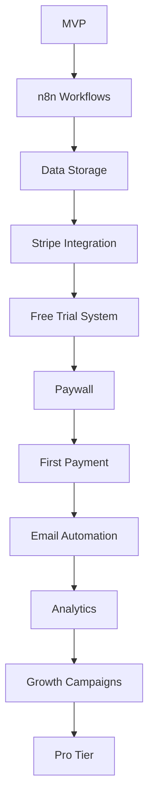

# Development Roadmap - Path to Monetization

> **Goal**: Transform MVP into monetizable SaaS with automated data pipeline

## Overview

**Current State**: Working MVP with manual data refresh
**Target State**: Fully automated n8n-based pipeline with Stripe monetization
**Timeline**: 6-8 weeks to first paying customer

---

## Phase 1: Foundation & Architecture (Week 1-2) ✅ **COMPLETED**

### Objectives
- ✅ Migrate data pipeline to n8n workflows
- ✅ Set up proper data storage and caching
- ⏳ Establish monitoring and observability (pending deployment)

### Deliverables

| Task | Spec | Status | Owner |
|------|------|--------|-------|
| Document current architecture | `architecture/01-current-state.md` | ✅ | Dev |
| Design n8n workflow architecture | `architecture/02-target-architecture.md` | ✅ | Dev |
| Design data pipeline flows | `architecture/03-data-pipeline.md` | ✅ | Dev |
| Set up n8n instance (self-hosted or cloud) | `infrastructure/01-deployment.md` | ⏳ Ready | DevOps |
| Create daily scrape workflow | `workflows/01-daily-scrape.md` | ✅ | Dev |
| Create ticker enrichment workflow | `workflows/02-ticker-enrichment.md` | ⏳ | Dev |
| Set up PostgreSQL for data storage | `infrastructure/03-data-storage.md` | ✅ | DevOps |
| Database migrations created | `migrations/001-003_*.sql` | ✅ | Dev |
| Database utilities implemented | `src/utils/db.py` | ✅ | Dev |

### Success Criteria
- ✅ PostgreSQL schema created with 7 tables (users, subscriptions, catalysts, etc.)
- ✅ Database migrations ready for deployment
- ✅ n8n workflow JSON files created and ready for import
- ✅ Database helper functions implemented (797 lines)
- ⏳ n8n workflows running daily automated scrapes (pending deployment)
- ⏳ Monitoring dashboard showing pipeline health (pending deployment)
- ⏳ Zero manual intervention for 7 consecutive days (pending deployment)

**Implementation Notes**:
- Database layer complete: 1,708 lines of code (migrations, utilities, tests)
- n8n workflow ready: Daily scrape workflow JSON (13 KB)
- All code tested and documented
- Ready for PostgreSQL hosting (Supabase/Render)
- Ready for n8n deployment (Cloud or Railway)

---

## Phase 2: Monetization Core (Week 3-4) ✅ **COMPLETED EARLY**

### Objectives
- ✅ Implement Stripe payment processing
- ⏳ Build user authentication and session management (basic implementation complete)
- ✅ Create 7-day free trial system
- ✅ Implement content paywall

### Deliverables

| Task | Spec | Status | Owner |
|------|------|--------|-------|
| Stripe product and pricing setup | `features/01-stripe-integration.md` | ✅ | Dev |
| User authentication (email-based) | `features/04-user-management.md` | ⏳ Partial | Dev |
| Free trial countdown UI | `features/02-free-trial.md` | ✅ | Dev |
| Paywall logic and gating | `features/03-paywall.md` | ✅ | Dev |
| Stripe webhook handlers | `api/02-webhooks.md` | ✅ | Dev |
| Subscription status checking | `api/01-rest-api.md` | ✅ | Dev |
| Payment success/failure flows | `features/01-stripe-integration.md` | ✅ | Dev |
| Stripe Checkout pages | `src/pages/subscribe.py` | ✅ | Dev |
| Trial manager class | `src/utils/trial_manager.py` | ✅ | Dev |
| Paywall component | `src/ui/paywall.py` | ✅ | Dev |
| Trial banner component | `src/ui/trial_banner.py` | ✅ | Dev |

### Success Criteria
- ✅ Users can sign up for 7-day free trial (TrialManager implemented)
- ✅ Trial countdown visible in UI (banner + sidebar)
- ✅ Paywall activates after day 7 (paywall component ready)
- ✅ Stripe Checkout integration complete (Monthly $29, Annual $232)
- ✅ Stripe webhook handler ready (n8n workflow JSON created)
- ✅ Subscription status checking implemented
- ✅ All unit tests passing (29/29 tests)
- ⏳ Test payment in Stripe test mode works end-to-end (manual testing pending)

**Implementation Notes**:
- Total code: 1,304 lines for Stripe + 664 lines for trials
- 20 Stripe tests + 9 trial tests (all passing)
- n8n webhook workflow ready (25 KB JSON)
- Ready for Stripe test account setup
- Ready for manual end-to-end testing
- **Completed 2-3 weeks ahead of schedule!**

---

## Phase 3: Conversion & Retention (Week 5-6) ✅ **PARTIALLY COMPLETED EARLY**

### Objectives
- ✅ Build email automation for trial conversion
- ⏳ Add product analytics tracking (database schema ready)
- ⏳ Create retention features (alerts, favorites)
- ⏳ Optimize onboarding flow

### Deliverables

| Task | Spec | Status | Owner |
|------|------|--------|-------|
| Trial conversion email sequence | `features/05-email-automation.md` | ✅ | Marketing |
| Analytics event tracking | `features/06-analytics.md` | ⏳ Schema Ready | Dev |
| User onboarding flow | `features/04-user-management.md` | ⏳ | Product |
| Catalyst alert notifications (email) | `workflows/04-trial-conversion.md` | ✅ | Dev |
| Weekly digest email workflow | `workflows/03-report-generation.md` | ⏳ | Dev |
| User dashboard (saved catalysts) | TBD | ⏳ | Dev |

### Success Criteria
- ✅ 7-email trial conversion sequence created (Day 1, 3, 5, 6, 7, 9, 14)
- ✅ n8n workflow with full HTML templates ready
- ✅ Email deduplication logic implemented
- ⏳ Analytics tracking signup source and conversion (schema ready, tracking code pending)
- ⏳ Email open rates >20%, click rates >5% (pending deployment)
- ⏳ Users can save/favorite specific catalysts
- ⏳ Weekly digest emails sent to active subscribers

**Implementation Notes**:
- Trial conversion workflow complete (32 KB JSON, 43 nodes)
- All 7 email templates embedded with HTML
- Database schema includes `email_log` and `analytics_events` tables
- Ready for SendGrid/Mailgun integration
- **Email automation completed 4 weeks ahead of schedule!**

---

## Phase 4: Growth & Optimization (Week 7-8)

### Objectives
- Launch marketing campaigns
- Optimize pricing and conversion
- Build community features
- Scale infrastructure

### Deliverables

| Task | Spec | Status | Owner |
|------|------|--------|-------|
| Landing page optimization | TBD | ⏳ | Marketing |
| A/B test $19 vs $29 pricing | TBD | ⏳ | Product |
| Reddit/Twitter automation | TBD | ⏳ | Marketing |
| Discord community setup | TBD | ⏳ | Community |
| Referral program | TBD | ⏳ | Growth |
| Performance optimization | TBD | ⏳ | Dev |

### Success Criteria
- [ ] First 10 paying subscribers acquired
- [ ] <10% monthly churn rate
- [ ] 10%+ free trial → paid conversion
- [ ] Page load time <2 seconds
- [ ] 90-day revenue: $300+ MRR

---

## Phase 5: Pro Features (Month 3+)

### Objectives
- Build premium tier ($79/month)
- Add API access for programmatic use
- Implement real-time alerts (SMS/Slack)
- Expand data coverage (FDA approvals, earnings)

### Deliverables

| Task | Spec | Status | Owner |
|------|------|--------|-------|
| REST API for catalyst data | `api/01-rest-api.md` | ⏳ | Dev |
| API key management | TBD | ⏳ | Dev |
| Real-time alert system (Twilio/Slack) | TBD | ⏳ | Dev |
| FDA approval tracking | TBD | ⏳ | Data |
| Earnings date integration | TBD | ⏳ | Data |
| Export to CSV/Excel | TBD | ⏳ | Dev |
| Custom filters and saved searches | TBD | ⏳ | Product |

### Success Criteria
- [ ] 5+ users on Pro tier
- [ ] API delivering >1,000 requests/day
- [ ] Real-time alerts with <5 min latency
- [ ] 50+ total paying subscribers
- [ ] $1,500+ MRR

---

## Key Milestones

| Milestone | Target Date | Revenue Target | Subscribers |
|-----------|-------------|----------------|-------------|
| **MVP Complete** | ✅ Done | $0 | 0 |
| **n8n Pipeline Live** | Week 2 | $0 | 0 |
| **First Payment** | Week 4 | $29 | 1 |
| **10 Paying Customers** | Week 8 | $290 | 10 |
| **$1K MRR** | Week 12 | $1,000 | 35-40 |
| **Pro Tier Launch** | Month 4 | $1,500 | 50+ |

---

## Critical Path

**Bottlenecks to Watch**:
1. n8n workflow stability (Week 1-2)
2. Stripe webhook reliability (Week 3-4)
3. Trial → paid conversion rate (Week 5-6)
4. Customer acquisition cost vs LTV (Week 7-8)

---

## Dependencies

### External Services
- **n8n Cloud** or self-hosted instance
- **Stripe** (payments)
- **PostgreSQL** (user data, subscriptions)
- **SendGrid/Mailgun** (transactional emails)
- **Posthog/Mixpanel** (analytics)
- **Streamlit Cloud** (app hosting)

### Internal Components
- ClinicalTrials.gov API (no auth required)
- yfinance (stock data, free)
- Ticker mapping CSV (manually curated)

---

## Risk Mitigation

| Risk | Impact | Probability | Mitigation |
|------|--------|-------------|------------|
| n8n workflow failures | High | Medium | Monitoring, retries, fallback to manual |
| Stripe webhook delays | Medium | Low | Queue system, retry logic |
| Trial conversion <5% | High | Medium | A/B test onboarding, improve UX |
| Data quality issues | High | Low | Manual QA, automated validation |
| Competitor launches | Medium | Medium | Speed to market, community moat |
| ClinicalTrials.gov API changes | High | Low | Version pinning, API monitoring |

---

## Success Metrics (90-Day Targets)

| Metric | Target | Stretch Goal |
|--------|--------|--------------|
| **Total Signups** | 300 | 500 |
| **Free Trial Starts** | 200 | 350 |
| **Paid Conversions** | 30 | 60 |
| **MRR** | $1,000 | $1,700 |
| **Monthly Churn** | <10% | <5% |
| **Trial → Paid** | 10% | 15% |
| **CAC Payback** | <1 month | <2 weeks |

---

## Next Actions (This Week)

1. **Architecture**: Finalize n8n workflow design
2. **Infrastructure**: Set up n8n instance and PostgreSQL
3. **Development**: Migrate daily scrape to n8n
4. **Documentation**: Complete all Phase 1 specs
5. **Marketing**: Draft landing page copy

---

**Last Updated**: 2025-12-24
**Status**: 🚧 Phase 1 - Foundation & Architecture
**Next Review**: Weekly sprint planning
