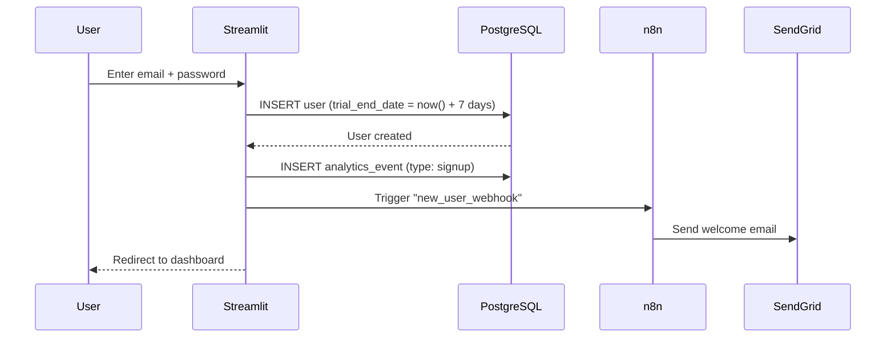
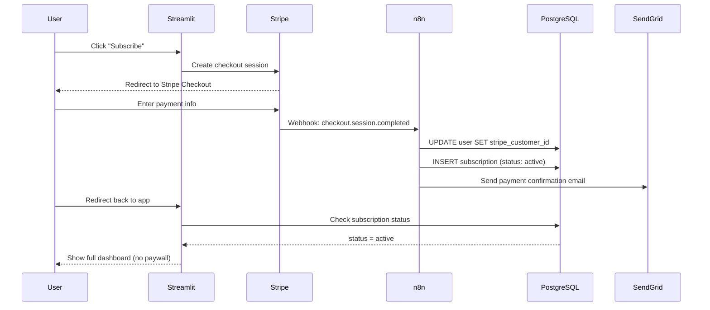

# Target Architecture - n8n-Based Monetizable SaaS

## Overview

The target architecture replaces manual processes with **automated n8n workflows**, adds a **proper data layer (PostgreSQL)**, and implements **full Stripe monetization** with user authentication.

## High-Level Architecture

```
┌─────────────────────────────────────────────────────────────┐
│                     User Browser                             │
└──────────────────┬──────────────────────────────────────────┘
                   │ HTTPS
                   ▼
┌─────────────────────────────────────────────────────────────┐
│           Streamlit Cloud (or Custom Hosting)                │
│                                                              │
│  ┌────────────────────────────────────────────────────┐    │
│  │  Streamlit App (src/app.py)                        │    │
│  │  ┌──────────────┐  ┌──────────────┐               │    │
│  │  │ UI Layer     │  │ Auth Layer   │               │    │
│  │  │ - Dashboard  │  │ - Login      │               │    │
│  │  │ - Charts     │  │ - Signup     │               │    │
│  │  │ - Paywall    │  │ - Trial mgmt │               │    │
│  │  └──────────────┘  └──────────────┘               │    │
│  └────────────────────────────────────────────────────┘    │
│                       │                                      │
│                       │ API calls                            │
└───────────────────────┼──────────────────────────────────────┘
                        │
                        ▼
┌─────────────────────────────────────────────────────────────┐
│                  PostgreSQL Database                         │
│                                                              │
│  Tables:                                                     │
│  ├── users (email, stripe_customer_id, trial_end_date)     │
│  ├── subscriptions (user_id, status, plan_id)              │
│  ├── catalysts (nct_id, ticker, phase, completion_date)    │
│  ├── catalyst_history (snapshot of daily data)             │
│  └── analytics_events (user_id, event_type, metadata)      │
└─────────────────────────────────────────────────────────────┘
                        │
                        │ Read/Write
                        │
┌─────────────────────────────────────────────────────────────┐
│                     n8n Workflow Engine                      │
│                  (Self-hosted or n8n Cloud)                  │
│                                                              │
│  ┌─────────────────────────────────────────────────────┐   │
│  │  Workflow 1: Daily Catalyst Scrape                  │   │
│  │  ────────────────────────────────────────────       │   │
│  │  Trigger: Cron (6 AM UTC daily)                     │   │
│  │                                                      │   │
│  │  [Cron] → [HTTP Request: ClinicalTrials.gov]       │   │
│  │            ↓                                         │   │
│  │         [Transform: Parse JSON]                     │   │
│  │            ↓                                         │   │
│  │         [Filter: Phase 2/3 only]                    │   │
│  │            ↓                                         │   │
│  │         [PostgreSQL: Upsert to catalysts table]    │   │
│  │            ↓                                         │   │
│  │         [Webhook: Trigger enrichment workflow]      │   │
│  └─────────────────────────────────────────────────────┘   │
│                                                              │
│  ┌─────────────────────────────────────────────────────┐   │
│  │  Workflow 2: Ticker Enrichment                      │   │
│  │  ────────────────────────────────────────────       │   │
│  │  Trigger: Webhook from Workflow 1                   │   │
│  │                                                      │   │
│  │  [Webhook] → [PostgreSQL: Get unenriched catalysts]│   │
│  │               ↓                                      │   │
│  │            [Loop: For each catalyst]                │   │
│  │               ├─ [Function: Fuzzy match ticker]     │   │
│  │               ├─ [HTTP: yfinance API]               │   │
│  │               └─ [PostgreSQL: Update catalyst]      │   │
│  │                  ↓                                   │   │
│  │            [PostgreSQL: Mark batch complete]        │   │
│  │               ↓                                      │   │
│  │            [Webhook: Trigger report generation]     │   │
│  └─────────────────────────────────────────────────────┘   │
│                                                              │
│  ┌─────────────────────────────────────────────────────┐   │
│  │  Workflow 3: Report Generation & Distribution       │   │
│  │  ────────────────────────────────────────────────   │   │
│  │  Trigger: Webhook from Workflow 2                   │   │
│  │                                                      │   │
│  │  [Webhook] → [PostgreSQL: Get enriched catalysts]  │   │
│  │               ↓                                      │   │
│  │            [Function: Generate HTML report]         │   │
│  │               ↓                                      │   │
│  │            [S3/Storage: Upload report.html]         │   │
│  │               ↓                                      │   │
│  │            [PostgreSQL: Save catalyst_history]      │   │
│  │               ↓                                      │   │
│  │            [Email: Send digest to subscribers]      │   │
│  └─────────────────────────────────────────────────────┘   │
│                                                              │
│  ┌─────────────────────────────────────────────────────┐   │
│  │  Workflow 4: Trial Conversion Automation            │   │
│  │  ────────────────────────────────────────────────   │   │
│  │  Trigger: Cron (hourly)                             │   │
│  │                                                      │   │
│  │  [Cron] → [PostgreSQL: Get trial users by day]     │   │
│  │            ↓                                         │   │
│  │         [Branch by trial day]                       │   │
│  │            ├─ Day 1: Welcome email                  │   │
│  │            ├─ Day 3: Feature highlight email        │   │
│  │            ├─ Day 5: Urgency email                  │   │
│  │            └─ Day 7: Trial expired → paywall        │   │
│  │               ↓                                      │   │
│  │         [SendGrid/Mailgun: Send email]              │   │
│  │               ↓                                      │   │
│  │         [PostgreSQL: Log email sent]                │   │
│  └─────────────────────────────────────────────────────┘   │
│                                                              │
│  ┌─────────────────────────────────────────────────────┐   │
│  │  Workflow 5: Stripe Webhook Handler                 │   │
│  │  ────────────────────────────────────────────────   │   │
│  │  Trigger: Stripe webhook (payment events)           │   │
│  │                                                      │   │
│  │  [Webhook] → [Function: Verify signature]          │   │
│  │               ↓                                      │   │
│  │            [Switch: Event type]                     │   │
│  │               ├─ customer.subscription.created      │   │
│  │               ├─ customer.subscription.updated      │   │
│  │               ├─ customer.subscription.deleted      │   │
│  │               └─ invoice.payment_failed             │   │
│  │                  ↓                                   │   │
│  │            [PostgreSQL: Update subscription status] │   │
│  │               ↓                                      │   │
│  │            [Email: Confirmation/failure notice]     │   │
│  └─────────────────────────────────────────────────────┘   │
└─────────────────────────────────────────────────────────────┘
                        │
                        │ External API calls
                        │
        ┌───────────────┼───────────────┐
        │               │                │
        ▼               ▼                ▼
┌──────────────┐ ┌──────────┐ ┌─────────────────┐
│ClinicalTrials│ │ yfinance │ │ Stripe API      │
│.gov API v2   │ │ (Yahoo)  │ │ (webhooks)      │
└──────────────┘ └──────────┘ └─────────────────┘
                                       │
                                       ▼
                              ┌─────────────────┐
                              │ SendGrid/Mailgun│
                              │ (email delivery)│
                              └─────────────────┘
```

---

## Component Details

### 1. Frontend - Enhanced Streamlit App

**Changes from MVP**:
- ✅ User authentication (email-based login)
- ✅ Session management with database persistence
- ✅ Trial countdown UI (days remaining)
- ✅ Paywall activation after day 7
- ✅ Subscription management (upgrade, cancel)

**New Features**:
- User dashboard (saved catalysts, alerts)
- Onboarding tour for new users
- Settings page (email preferences, notifications)

**Technology**: Streamlit + `streamlit-authenticator` or custom auth

---

### 2. Data Layer - PostgreSQL

**Why PostgreSQL?**
- Structured data with relationships (users → subscriptions → catalysts)
- ACID compliance for payment events
- Efficient querying and indexing
- Historical data tracking
- Free tier on Supabase or Render

**Schema**:

```sql
-- Users table
CREATE TABLE users (
    id UUID PRIMARY KEY DEFAULT gen_random_uuid(),
    email VARCHAR(255) UNIQUE NOT NULL,
    created_at TIMESTAMP DEFAULT NOW(),
    trial_start_date TIMESTAMP,
    trial_end_date TIMESTAMP,
    stripe_customer_id VARCHAR(255) UNIQUE,
    onboarding_completed BOOLEAN DEFAULT FALSE
);

-- Subscriptions table
CREATE TABLE subscriptions (
    id UUID PRIMARY KEY DEFAULT gen_random_uuid(),
    user_id UUID REFERENCES users(id) ON DELETE CASCADE,
    stripe_subscription_id VARCHAR(255) UNIQUE,
    status VARCHAR(50), -- active, canceled, past_due, trialing
    plan_id VARCHAR(100), -- monthly, annual
    current_period_end TIMESTAMP,
    created_at TIMESTAMP DEFAULT NOW(),
    updated_at TIMESTAMP DEFAULT NOW()
);

-- Catalysts table
CREATE TABLE catalysts (
    id UUID PRIMARY KEY DEFAULT gen_random_uuid(),
    nct_id VARCHAR(50) UNIQUE NOT NULL,
    sponsor VARCHAR(255),
    ticker VARCHAR(10),
    ticker_confidence_score INTEGER,
    phase VARCHAR(50),
    indication TEXT,
    completion_date DATE,
    market_cap BIGINT,
    current_price DECIMAL(10, 2),
    pct_change_30d DECIMAL(5, 2),
    data_refreshed_at TIMESTAMP DEFAULT NOW(),
    created_at TIMESTAMP DEFAULT NOW()
);

-- Catalyst history (snapshots)
CREATE TABLE catalyst_history (
    id UUID PRIMARY KEY DEFAULT gen_random_uuid(),
    catalyst_id UUID REFERENCES catalysts(id),
    snapshot_date DATE,
    market_cap BIGINT,
    current_price DECIMAL(10, 2),
    pct_change_30d DECIMAL(5, 2)
);

-- Analytics events
CREATE TABLE analytics_events (
    id UUID PRIMARY KEY DEFAULT gen_random_uuid(),
    user_id UUID REFERENCES users(id) ON DELETE SET NULL,
    event_type VARCHAR(100), -- page_view, signup, trial_start, conversion, churn
    event_metadata JSONB,
    created_at TIMESTAMP DEFAULT NOW()
);

-- Email log
CREATE TABLE email_log (
    id UUID PRIMARY KEY DEFAULT gen_random_uuid(),
    user_id UUID REFERENCES users(id),
    email_type VARCHAR(100), -- trial_day_1, trial_day_3, etc.
    sent_at TIMESTAMP DEFAULT NOW(),
    opened_at TIMESTAMP,
    clicked_at TIMESTAMP
);
```

**Indexes**:
```sql
CREATE INDEX idx_users_email ON users(email);
CREATE INDEX idx_subscriptions_status ON subscriptions(status);
CREATE INDEX idx_catalysts_ticker ON catalysts(ticker);
CREATE INDEX idx_catalysts_completion_date ON catalysts(completion_date);
CREATE INDEX idx_analytics_user_id ON analytics_events(user_id);
```

---

### 3. Workflow Engine - n8n

**Why n8n?**
- Visual workflow builder (low-code)
- Self-hostable (Docker) or cloud-hosted
- 300+ integrations (Stripe, SendGrid, PostgreSQL)
- Webhook triggers and cron scheduling
- Error handling and retry logic built-in

**Hosting Options**:
1. **n8n Cloud** ($20/month) - Easiest, managed
2. **Self-hosted (Docker)** - Free, requires VPS ($5-10/month)
3. **Railway/Render** - Deploy n8n container ($5/month)

**Key Workflows**:
1. **Daily Catalyst Scrape** - See `workflows/01-daily-scrape.md`
2. **Ticker Enrichment** - See `workflows/02-ticker-enrichment.md`
3. **Report Generation** - See `workflows/03-report-generation.md`
4. **Trial Conversion** - See `workflows/04-trial-conversion.md`
5. **Stripe Webhooks** - See `api/02-webhooks.md`

---

### 4. Monetization - Stripe Integration

**Components**:
- Stripe Checkout (payment pages)
- Stripe Customer Portal (self-service)
- Stripe Webhooks (event notifications)
- Stripe Billing (subscription management)

**User Flow**:
```
1. User signs up → Create user in DB, set trial_end_date = now() + 7 days
2. User browses 7 days → Track usage in analytics_events
3. Day 7 → Paywall activates, link to Stripe Checkout
4. User pays → Stripe sends webhook → n8n updates DB → User gets access
5. Monthly billing → Stripe handles automatically
6. User cancels → Stripe webhook → n8n marks subscription canceled
```

**Stripe Products**:
- **Monthly Plan**: $29/month (recurring)
- **Annual Plan**: $232/year (recurring annually)

---

### 5. Email Automation - SendGrid/Mailgun

**Email Sequences**:

**Trial Conversion (7 emails)**:
- Day 1: Welcome + onboarding
- Day 3: Feature highlight (price charts)
- Day 5: Social proof (user testimonial - once we have them)
- Day 7: Trial expiring soon (24hr warning)
- Day 8: Trial expired, subscribe now
- Day 10: Last chance (50% off first month - optional)
- Day 14: Re-engagement (cold email)

**Transactional Emails**:
- Payment successful
- Payment failed
- Subscription renewed
- Subscription canceled

**Digest Emails** (weekly for subscribers):
- Top 5 upcoming catalysts
- Recent price movements
- New trials added this week

---

## Data Flow - Target Architecture

### User Signup Flow



### Daily Data Refresh Flow

```mermaid
sequenceDiagram
    participant Cron
    participant n8n
    participant ClinicalTrials
    participant PostgreSQL
    participant yfinance

    Cron->>n8n: Trigger daily scrape (6 AM UTC)
    n8n->>ClinicalTrials: GET /api/v2/studies
    ClinicalTrials-->>n8n: Return trials JSON
    n8n->>PostgreSQL: UPSERT catalysts (by nct_id)
    n8n->>n8n: Trigger enrichment workflow
    n8n->>PostgreSQL: SELECT catalysts WHERE ticker IS NULL
    loop For each catalyst
        n8n->>n8n: Fuzzy match sponsor → ticker
        n8n->>yfinance: GET stock data
        yfinance-->>n8n: Return price, market cap
        n8n->>PostgreSQL: UPDATE catalyst SET ticker, market_cap, price
    end
    n8n->>PostgreSQL: INSERT catalyst_history (snapshot)
    n8n->>n8n: Trigger report generation
```



### Payment Flow



---

## Technology Stack - Target

| Layer | Technology | Cost | Why |
|-------|------------|------|-----|
| **Frontend** | Streamlit | Free (Community Cloud) | Simple, Python-native |
| **Database** | PostgreSQL | Free (Supabase/Render) | Relational, ACID |
| **Workflows** | n8n | $0-20/mo | Visual, integrations |
| **Payments** | Stripe | 2.9% + $0.30 | Industry standard |
| **Email** | SendGrid | Free (100/day) | Reliable, transactional |
| **Analytics** | Posthog | Free (1M events) | Self-hosted option |
| **Monitoring** | BetterStack | Free tier | Uptime + logs |
| **Hosting** | Railway/Render | $5-10/mo | Easy PaaS |

**Total Monthly Cost**: $5-30 (depending on self-hosted vs managed)

---

## Migration Plan

See: [ROADMAP.md](../ROADMAP.md) for detailed timeline

**Phase 1** (Week 1-2): Infrastructure
- [ ] Set up PostgreSQL database
- [ ] Deploy n8n instance
- [ ] Migrate daily scrape to n8n workflow

**Phase 2** (Week 3-4): Monetization
- [ ] Add user authentication
- [ ] Integrate Stripe
- [ ] Implement free trial system
- [ ] Deploy webhook handlers

**Phase 3** (Week 5-6): Automation
- [ ] Build email sequences
- [ ] Add analytics tracking
- [ ] Create retention features

---

## Advantages Over Current Architecture

| Feature | Current | Target | Improvement |
|---------|---------|--------|-------------|
| **Data Storage** | CSV files | PostgreSQL | Queryable, relational |
| **Automation** | GitHub Actions | n8n workflows | Visual, flexible, reliable |
| **User Data** | Session only | Database | Persistent, multi-device |
| **Payments** | None | Stripe | Full monetization |
| **Emails** | None | SendGrid | Trial conversion |
| **Monitoring** | None | BetterStack | Uptime alerts |
| **Scalability** | Single instance | Horizontal | Handle growth |
| **Cost** | $0/mo | $5-30/mo | Minimal increase |

---

**Last Updated**: 2025-12-24
**Status**: 📝 Spec Draft
**Next**: Implement Phase 1 infrastructure
